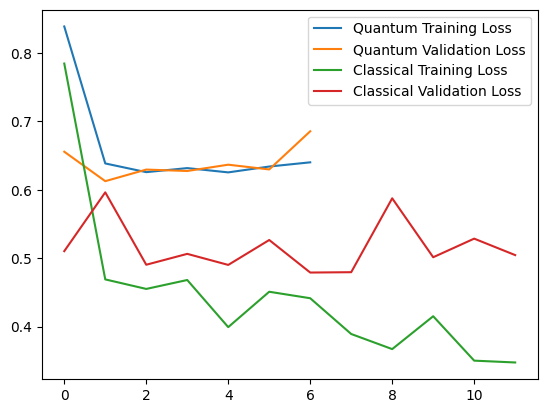
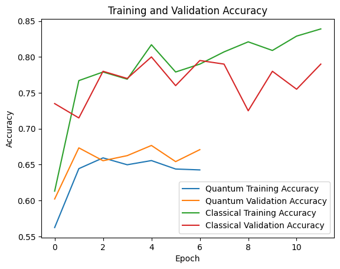

---

# Kvantum Neurális Hálózat és Klasszikus Neurális Hálózat Összehasonlító Értékelés

## Projekt Áttekintés

Ez a projekt a kvantum  neurális hálózat (QNN) és egy klasszikus neurális hálózat (NN) teljesítményét hasonlítja össze a **CIFAR-10** képadatbázison, amely 10 különböző osztályú képet tartalmaz. A projekt célja annak vizsgálata, hogy a kvantuminformatikai módszerek hogyan teljesítenek azonos körülmények között egy hagyományos neurális hálózathoz képest.

## Adatkészlet

Az adatok a CIFAR-10 adatbázisból származnak, amely **50,000 tanítóképet** és **10,000 tesztképet** tartalmaz. A képeket 10 kategóriába sorolták, mint például repülőgép, autó, madár stb.

## Modell Felépítése

### Klasszikus Neurális Hálózat

A klasszikus modell egy egyszerű többrétegű perceptron, amely két sűrű réteget tartalmaz:

1. **Rejtett réteg**: 128 neuron, ReLU aktivációs függvény.
2. **Kimeneti réteg**: 1 neuron, sigmoid aktivációs függvény.

Az optimalizáláshoz Adam optimizálót használtunk, a célfüggvény pedig bináris keresztentrópia volt.

### Kvantum Neurális Hálózat

A QNN egy kvantum számítógépen futtatott hibrid modell, amely 10-12 kvantumbit (qubit) segítségével végzi az információ feldolgozását. A QNN felépítése:

1. **Qubit állapotok**: Minden pixel adatot qubit forgatási szöggé alakítunk.
2. **Kvantum kapuk**: Minden qubit kap egy Rx és Ry forgatást, majd CNOT kapuk kapcsolják össze a qubitokat.

A kvantumrétegek között a differenciálás az Adjoint módszer segítségével történik, ami hatékonyabb és gyorsabb.

## Tanítás és Kiértékelés

A projekt két különálló modellt alkalmazott az alábbi beállítások szerint:

- **QNN**: 12 qubit, 3 rétegű kvantumkapu mélységgel, 50 epoch, 32-es batch méret.
- **Klasszikus NN**: 128 neuronos rejtett réteg, 50 epoch, 32-es batch méret.

### Eredmények

Az alábbi diagramok mutatják a két modell tanulási görbéit:

- **Veszteség (loss)**: Mind a kvantum, mind a klasszikus modell tanulási veszteségét ábrázolja az edzési és validációs adatokon.
- **Pontosság (accuracy)**: A QNN és a klasszikus NN teljesítménye az edzési és validációs adatokon.

### Ábrák

#### Veszteség Diagram

#### Pontosság Diagram

##Következtetés

A QNN teljesítménye nem haladta meg a klasszikus modellét, és az edzés is lassabb volt. Mindazonáltal a QNN kevesebb paraméterrel dolgozott, ami potenciálisan előnyös lehet nagyobb adatbázisok és nagyobb számítási erőforrások használata esetén. Ez a projekt kezdeti lépéseket tesz a kvantumszámítási módszerek gyakorlati alkalmazása felé a neurális hálózatok területén.

---

Ez a README dokumentum áttekintést nyújt a projekt struktúrájáról és a két hálózat teljesítményének összehasonlításáról.
